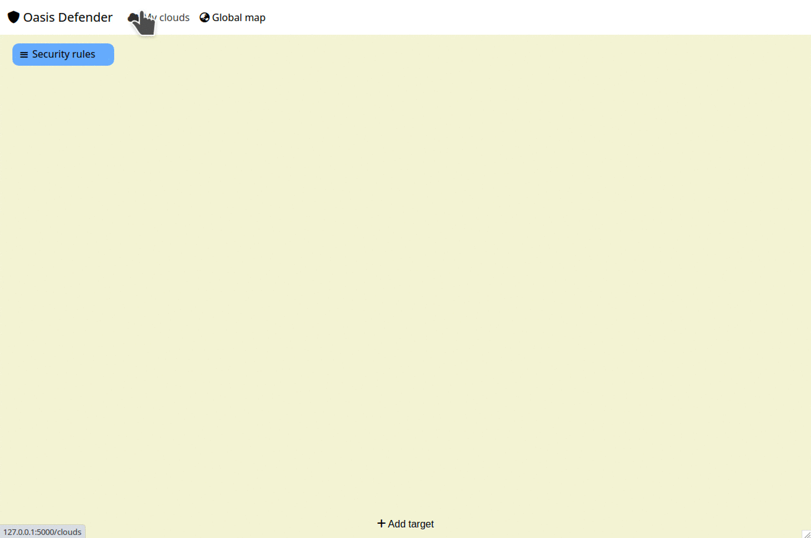
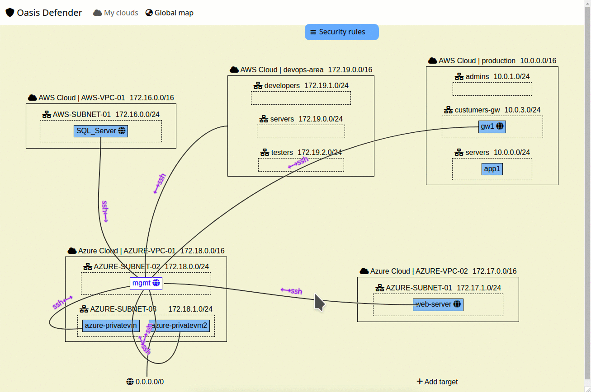
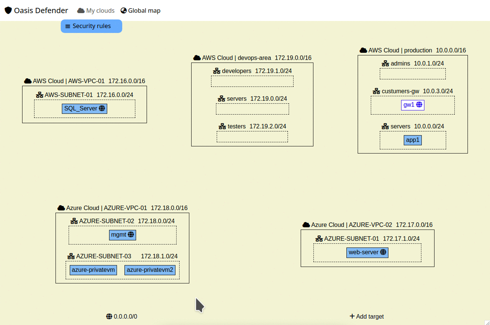

# Oasis Defender - AI-Driven Software for unified visualization and configuration of multi-cloud security
<div id="badges" align="center">
  <a href="https://oasisdefender.com">
    
  </a>
  <a href="https://twitter.com/OasisDefender">
    
  </a>
  <a href="mailto:contact@oasisdefender.com">
    
  </a>
</div>

<p align="center">

</p>

## Overview

Oasis Defender is a powerful tool to create unified cross-cloud security.

# Installation

## For Docker users

``` bash
# Pull last docker image
# See last version at https://github.com/OasisDefender/oasis/pkgs/container/oasis
$ docker pull ghcr.io/oasisdefender/oasis:<tag>

# Load docker image
$ mkdir -p /home/$USER/.db && docker run -d --name oasis --restart always -p 127.0.0.1:5000:5000 -v /home/$USER/.db:/app/db --user $UID:$UID --hostname=$USER@oasis oasis

# Note: Database placed to directory - /home/$USER/.db. Database conteins autentification params for cloud connection. We recommend that you protect this directory from unauthorized users. For example:
$ chmod 0700 /home/$USER/.db

# Oasis is ready to use. Launch your browser and follow the link: http://127.0.0.1:5000
```

## Manual installation
``` bash
# Download software
$ wget https://github.com/OasisDefender/oasis/archive/refs/heads/0.0.1.zip

# Extract archive
$ unzip oasis-0.0.1.zip

# Go to sources directory
$ cd oasis-0.0.1

# Install requirements
$ pip3.10 install -r requirements.txt

# Run oasis server
$ python3.10 app.py

# Oasis is ready to use. Launch your browser and follow the link: http://127.0.0.1:5000
```


# Usage

Once properly installed, you will be presented with startup screen at http://127.0.0.1:5000.


## Clouds Registration

You can register your clouds (Amazon AWS and Microsoft Azure supported)

<p align="center">

</p>

## Automatic Inventorization

The resource information of the registered clouds (external network resources, virtual networks, virtual machines, existing filtering rules) will be collected.

<p align="center">

</p>


## Connections

You can create a visual connections between resources in your clouds, including cross-cloud connections.

<p align="center">

</p>
